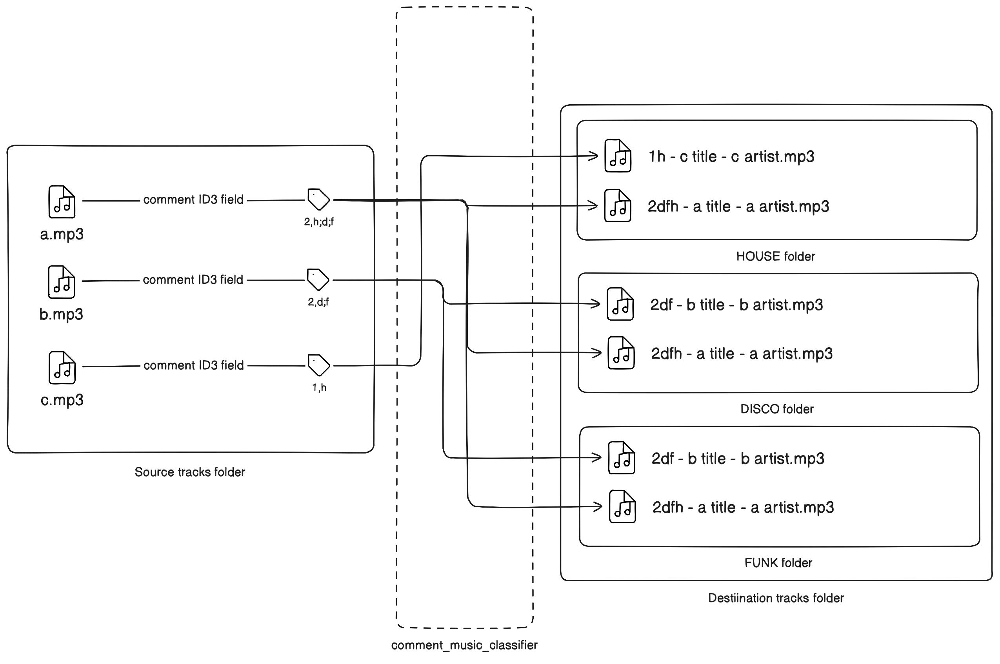

# Comment Music Classifier

Classify music in folders using comment tag in audio files metadata.
Allows fast live-searching of music for DJs.

## Why

Because CDJ-850 screens are extra-small and I can't easily find similar tracks on it.


## Solution



Tag your tracks in the comment section (with software like kid3). It will copy it in associated folders
(see instructions for details). The copied track file name is renamed with the
tag at the beggining. So similar tracks are closed to each other when scrolling
(thanks to sorting by file name).

## Drawbacks

- If you put 3 tags per track, it will take 3-times more disk space. (as tracks
are copied in corresponding folders)
- Only works with `wav`, `mp3` and `aiff`
- Music is not analyzed. So BPM will be approximated on DJ gear.

## Instructions

- Add custom tags to the comment section of ID3 tag in your songs.
E.g: setting the comment to `2,b;a` for `MyMusic/my_track.mp3` will copy this
music to
  - `MyTargetFolder/a/2ab My Track Title - My Track Artist.mp3`
  - `MyTargetFolder/b/2ab My Track Title - My Track Artist.mp3`

- Install `cargo`

- Run

```shell
cargo run -- -s path/to/folder/of/tracks -t path/to/target/folder
```

- On the DJ gear, browse USB folder where you copied the tracks
